# NFT Generator
NFT Generator **turbocharges your creativity** by transforming isolated assets into **an explosion of unique NFT possibilities.** Forget painstaking manual combinations – The addon **randomizes, renders, and rules** your way to a diverse, stunning collection in a **single click.**

[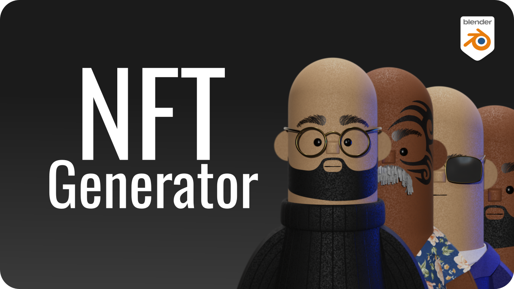](https://youtu.be/YeOw6D8kVhM)


## Features
* **Randomly combine** Objects, Collections, Materials, Textures, Worlds or Animation Actions – generate **thousands of unique variations**.
* **Batch-render** your entire collection with one click.
* **Automate metadata generation:** NFT Generator **populates essential details** for each token in JSON format.
* Define **rarity** for individual assets, controlling the frequency they appear in your collection.
* Set **rules** to **associate or disassociate traits,** ensuring specific combinations appear (or never do).
* Retain **control** over each token **individually**, to finetune the traits choices when needed.


# User Guide
## Generate
### Trait
A trait refers to a specific characteristic or element that can be present on an NFT. It's a building block that, when combined with others, contributes to the overall visual and metadata makeup of each unique NFT in the collection.
#### Examples
- Skin Color
- Eyewear
- Background
#### Traits Types
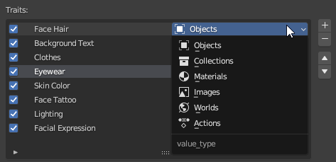

Traits can be used to control many aspects in the scene, not just `Objects` and `Collections`.
##### On `Materials`, `Images` and `Actions`
These 3 trait types need a `datablock` to be assigned to, the addon looks into all the trait choices and tries to find this `datablock`, otherwise it doesn't know which `datablock` in the scene to operate on, so:
- At least one of the **materials** in a trait needs to be assigned to an **object**.
- At least one of the **images** in a trait needs to be assigned to a **material** (as a texture in the shader nodes tree).
- At least one **action** in a trait needs to be assigned to an **object**. 
### Choice
Choices are the selected attributes to be assigned to a [trait](#Trait).
#### Examples
- Skin Color: Brown
- Eyewear: Sunglasses
- Background: Blue
#### Rarity
A percentage that resembles (approximately) how frequently a choice will be assigned to a trait.
##### Example
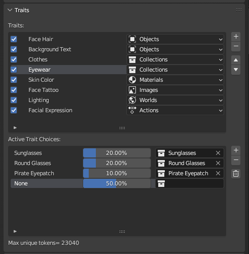

`Pirate Eyepatch` will show up only in 10% of the tokens.
##### Max Unique Tokens
Is the maximum count of tokens that can be generated from all the assigned traits and choices, this number does not account for changes in `Rarity` and `Rules`.
### Rules
Rules let you say "yes, this goes together" or "no, that's not allowed" for different traits, shaping your collection's look and rarity.
#### Never With
Never associate Choice 1 and Choice 2 in the same token
#### Only With
Pick Choice 2 whenever Choice 1 exists
#### Always Pair With
Always associate Choice 1 and Choice 2 together, whenever any of them exists, the other should be assigned
#### Example
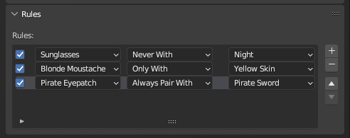
1. `Sunglasses` will never show up in `Night` lighting.
2. `Blonde Moustache` will only show up on tokens with `Yellow Skin`.
3. Any token with `Pirate Eyepatch` will always use a `Pirate Sword` and vice versa.
## Edit
### Navigate Tokens
 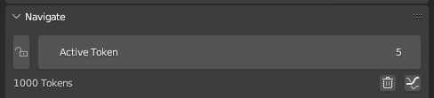

 Change `Active Token` value to navigate through the collection, the addon will update the viewport to reflect the active token choices.
### Edit Individual Token Traits
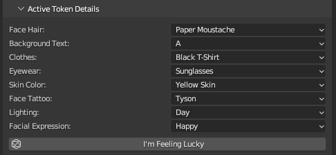

Ever stare at your NFT collection, wishing you could tweak just one thing here or there? NFT Generator empowers you to change any choice of a token individually to fine tune your perfect collection.
### Tokens Stats
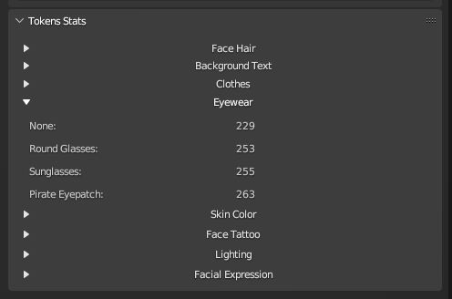

The `Token Stats` is a **read only** section that provides a comprehensive overview of your generated collection, revealing the frequency of each trait choice.
## Export
### Output Folder
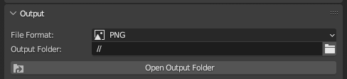

- `Output folder` is the parent folder where the rendered images and their metadata files are exported (`render` and `metadata`).
- By default output folder is set to `//` which an eloquent way to say it's the same folder where your blend file is saved, the addon creates the `render` and `metadata` folders for you if they don't exist. 
- `Open Output Folder` is a quick option to open the output folder in your OS file manager.
### Token Metadata
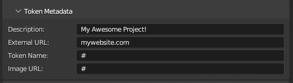
- `Description`: A description for your collection.
- `External URL`: The homepage of your collection.
- Token Name: The token id that shows up in the `name` key in metadata file, the hash `#` symbol is a placeholder for the **token number (index)**, you can add any suffix or prefix to it, make sure not to delete the `#` symbol otherwise all the tokens will end up having the same name or image in the collection.
#### Sample JSON metadata
```json
{
    "description": "My Awesome Project!",
    "external_url": "mywebsite.com",
    "image": "14.png",
    "name": "14",
    "attributes": [
        {
            "trait_type": "Face Hair",
            "value": "Paper Moustache"
        },
        {
            "trait_type": "Background Text",
            "value": "D"
        },
        {
            "trait_type": "Clothes",
            "value": "Tanktop"
        },
        {
            "trait_type": "Eyewear",
            "value": "Pirate Eyepatch"
        },
        {
            "trait_type": "Skin Color",
            "value": "Yellow Skin"
        },
        {
            "trait_type": "Face Tattoo",
            "value": "Empty"
        },
        {
            "trait_type": "Lighting",
            "value": "Night"
        },
        {
            "trait_type": "Facial Expression",
            "value": "Angry"
        }
    ]
}
```
#### Token Name and URL
Example of  `token name` and `image URL` prefixes:

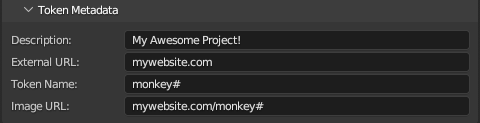
#### Sample JSON metadata
```json
{
    "description": "My Awesome Project!",
    "external_url": "mywebsite.com",
    "image": "mywebsite.com/monkey16.png",
    "name": "monkey16",
    "attributes": [
        {
            "trait_type": "Face Hair",
            "value": "None"
        },
        {
            "trait_type": "Background Text",
            "value": "B"
        },
        {
            "trait_type": "Clothes",
            "value": "Ballmer Shirt"
        },
        {
            "trait_type": "Eyewear",
            "value": "Pirate Eyepatch"
        },
        {
            "trait_type": "Skin Color",
            "value": "Brown Skin"
        },
        {
            "trait_type": "Face Tattoo",
            "value": "Tyson"
        },
        {
            "trait_type": "Lighting",
            "value": "Day"
        },
        {
            "trait_type": "Facial Expression",
            "value": "Angry"
        }
    ]
}
```
### Render/Export
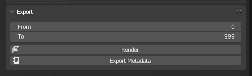
- `From` and `To` could be helpful if you had to edit some tokens after all the collection was rendered already, you can assign only the updated ones.
- `Render` to render all your tokens within the `From`: `To` range.
- `Export Metadata` to export all metadata files within the same `From`: `To` range.
## Buy the Addon
- [https://premiero.gumroad.com/l/nftgen](https://premiero.gumroad.com/l/nftgen) 

## Installation
1. Go to `Edit` > `Preferences` > `Addons`
2. Press `Install` button and browse to the addon `zip` file.  
## Contact Me
- Twitter: [@ahmed_ali](https://twitter.com/ahmed_ali)
- Mastodon: [premiero@mastodon.world](https://mastodon.world/@premiero)
- Hire me on [Upwork](https://www.upwork.com/freelancers/~0139b13dfd3e208f29)